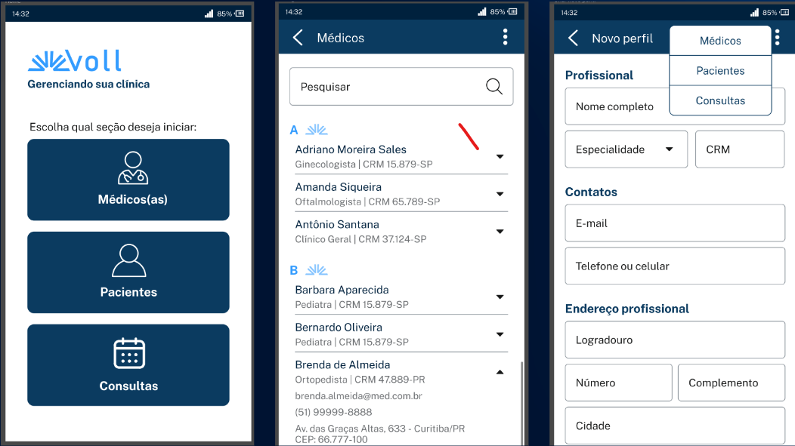
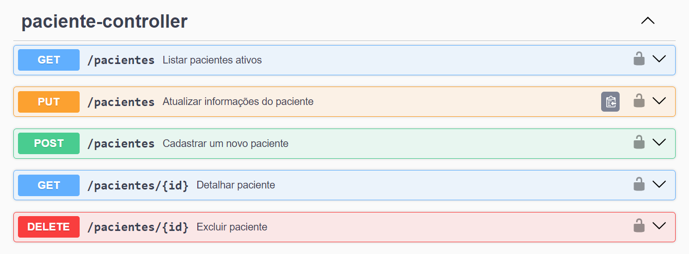
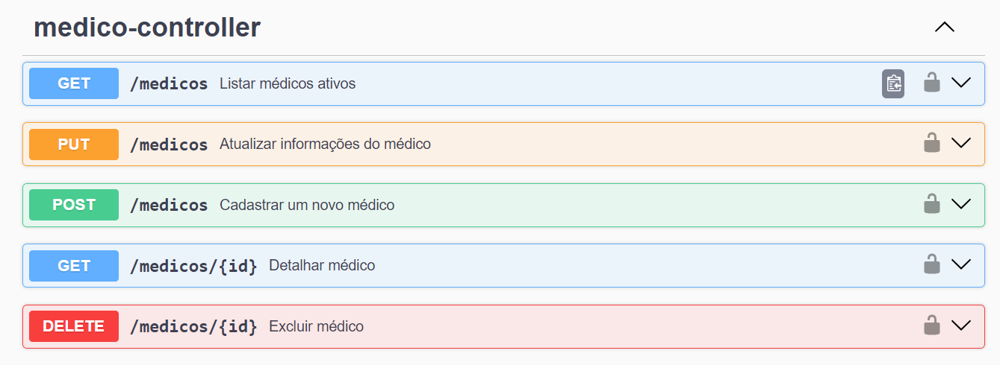
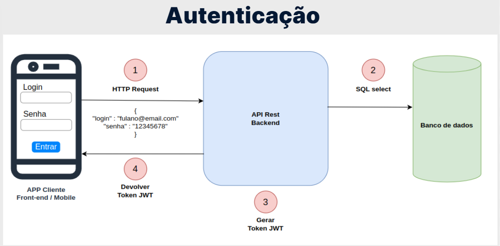
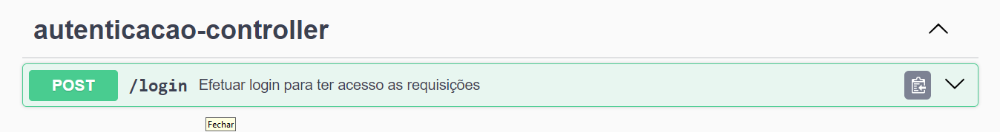
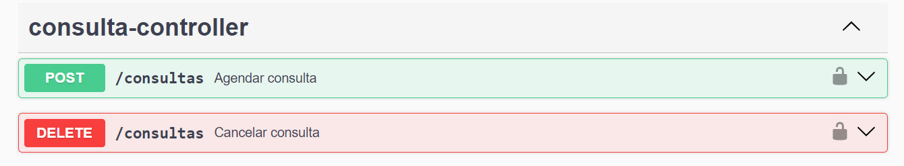

<div style="display: flex; align-items: center;">
    
    <div>
        <h2>VOLL.MED - Sistema de Clínica Médica com Spring Boot</h2>
        <p>API Rest, contendo as funcionalidades de CRUD de médicos e de pacientes, além de agendamento e cancelamento de consultas</p>
    </div>
</div>



* Layout mobile da aplicação, utilizada de exemplo para a criação da API <a hrf="https://www.figma.com/file/N4CgpJqsg7gjbKuDmra3EV/Voll.med">layout</a>

# API de Clínica Médica

Esta API oferece endpoints para gerenciar pacientes, médicos, autenticação e agendamento de consultas.
<hr>

## Paciente Controller


### Listar Pacientes Ativos

**Método:** GET  
**Endpoint:** /pacientes  
**Descrição:** Retorna a lista de pacientes ativos.

### Atualizar Informações do Paciente

**Método:** PUT  
**Endpoint:** /pacientes  
**Descrição:** Atualiza as informações de um paciente existente.

### Cadastrar Novo Paciente

**Método:** POST  
**Endpoint:** /pacientes  
**Descrição:** Cadastra um novo paciente na base de dados.

### Detalhar Paciente

**Método:** GET  
**Endpoint:** /pacientes/{id}  
**Descrição:** Retorna detalhes específicos de um paciente.

### Excluir Paciente

**Método:** DELETE  
**Endpoint:** /pacientes/{id}  
**Descrição:** Remove um paciente da base de dados.
<hr>

## Médico Controller



### Listar Médicos Ativos

**Método:** GET  
**Endpoint:** /medicos  
**Descrição:** Retorna a lista de médicos ativos.

### Atualizar Informações do Médico

**Método:** PUT  
**Endpoint:** /medicos  
**Descrição:** Atualiza as informações de um médico existente.

### Cadastrar Novo Médico

**Método:** POST  
**Endpoint:** /medicos  
**Descrição:** Cadastra um novo médico na base de dados.

### Detalhar Médico

**Método:** GET  
**Endpoint:** /medicos/{id}  
**Descrição:** Retorna detalhes específicos de um médico.

### Excluir Médico

**Método:** DELETE  
**Endpoint:** /medicos/{id}  
**Descrição:** Remove um médico da base de dados.
<hr>

## Autenticação Controller



### Efetuar Login

**Método:** POST  
**Endpoint:** /login  
**Descrição:** Permite a autenticação para ter acesso às requisições da API.
<hr>

## Consulta Controller



### Agendar Consulta

**Método:** POST  
**Endpoint:** /consultas  
**Descrição:** Agenda uma nova consulta.

### Cancelar Consulta
**Método:** DELETE  
**Endpoint:** /consultas  
**Descrição:** Cancela uma consulta agendada.

<hr>

# Descrição Técnica
A API foi desenvolvida utilizando tecnologias robustas para garantir eficiência, segurança e flexibilidade. Abaixo, destacamos as principais tecnologias empregadas:

### Java
* A linguagem de programação Java foi escolhida como base para o desenvolvimento da API, oferecendo robustez e portabilidade em diferentes ambientes.

### Spring Boot
* O framework Spring Boot foi utilizado para agilizar o desenvolvimento, facilitando a criação de aplicativos Java baseados em microsserviços. Ele proporciona configurações simplificadas, favorecendo o desenvolvimento rápido e eficiente.

### Spring Security
* A segurança é uma prioridade na API de Clínica Médica, e o Spring Security oferece recursos abrangentes para autenticação e autorização. Isso assegura que apenas usuários autenticados e autorizados tenham acesso às funcionalidades críticas da aplicação.

### Json Web Token (JWT)
* O JSON Web Token é adotado para a implementação da autenticação baseada em token. Isso proporciona uma abordagem segura e eficiente para a comunicação entre cliente e servidor, garantindo integridade e autenticidade.

### PostgreSQL
* O banco de dados PostgreSQL foi escolhido para armazenar os dados da aplicação devido à sua confiabilidade e recursos avançados. Ele oferece suporte robusto para consultas complexas e transações, garantindo consistência e escalabilidade.

### Springdoc
* A documentação da API é gerada automaticamente com o Springdoc OpenAPI, facilitando a compreensão e integração por parte dos desenvolvedores. Isso proporciona uma documentação sempre atualizada e legível, seguindo as especificações do OpenAPI.

````
Essas tecnologias combinadas formam uma base sólida para a API de Clínica Médica, garantindo um sistema eficiente, seguro e bem documentado.
````

<hr>

### Contribuições
* Contribuições são bem-vindas! Sinta-se à vontade para abrir problemas, propor melhorias ou enviar solicitações de pull.
<hr>

[](https://www.linkedin.com/in/jeancarlotorre619b/)

⭐️ Star o projeto

🐛 Encontrar e relatar issues
